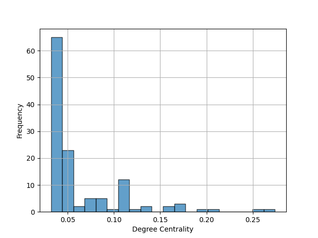
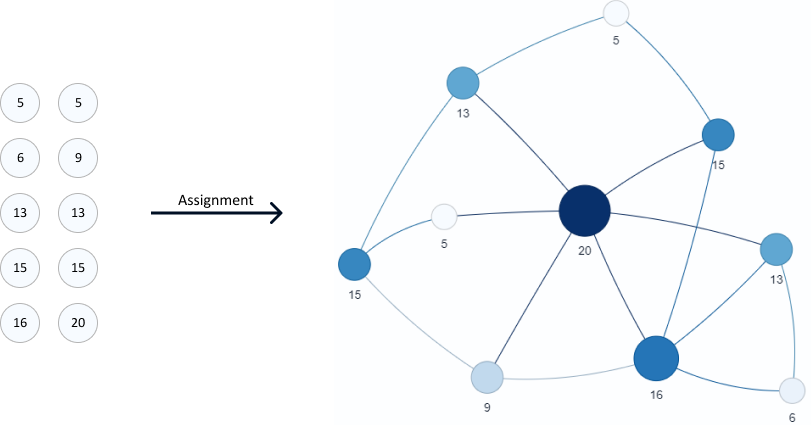

# A Scale-free Networked Genetic Algorithm with Balanced Exploration and Exploitation

In our proposed approach, we use a metric that combines phenotypic and genotypic similarities to establish inter-chromosomal links. We define phenotypic and genotypic similarities between two chromosomes as the differences in their fitness values and gene content, respectively. The created inter-chromosomal links form a scale-free topology that drives the evolutionary process in a way that maintains a balance of exploration and exploitation.

## Installation

To install the code, first clone the repository

```bash
  git clone https://github.com/Murf-y/Enhanced-Networked-Genetic-Algorithm
```

Then install necessary packages to run the code

```bash
  pip install -r requirements.txt
```

## Usage

All GA algorithms implemented inherit from the parent GA class. To run a specific genetic algorithm, you only need to use the `main.py` file. Therefore, there is no need to open any other file for configuration. To view the code of each variation created for the genetic algorithm, open the corresponding file with the name of the variation.

### Benchmark Functions

In `main.py`, first, we get the benchmark functions to use.
To run on all benchmark functions, you can use:

```python
benchmark_functions = get_all_functions()
```
To run on a specific set of benchmark functions, you can get them by name, for example:
```py
benchmark_functions = get_functions_by_name(['f2', 'f5'])
```

### Benchmark & GA variations

1. In `main.py`, after specifying the benchmark functions to use, we create an instance of a `Benchmark` given a genetic algorithm class.
For example:

```py
benchmark_functions = get_all_functions()

# Enhanced Networked Genetic Algorithm
enhanced_nga_benchmark = Benchmark(genetic_algorithm=EnhancedNetworkGeneticAlgorithm, number_of_runs=1, benchmark_functions=benchmark_functions, number_of_generations=2000, population_size=125, number_elites=0, probability_crossover=0.95, probability_mutation=0.1, verbose=True, save_metrics=True)
```

The above code, would create a Benchmark instance, with the ENGA as a genetic algorithm variation, this algorithm will run on the benchmark functions already defined  `number_of_runs` times. The ENGA will run with 125 as the number of individuals in the population, 2000 as the maximum generations, 95% probability of crossover and 10% probability of mutation. `Verbose=True`, means that the results logs will be displayed in the console with a progress bar, the `save_metrics=True` will save the metrics of the benchmark for each run.

2. To run the benchmark instance already created, you simply run

```py
enhanced_nga_benchmark.run()
```

3. Currently all GA variation have a benchmark instance, hence to run them uncomment one or more of the below lines:

```py
# enhanced_nga_benchmark.run()
# nga_benchmark.run()
# ga_benchmark.run()
# crga_benchmark.run()
# dcga_benchmark.run()
```

## Images

### Degree distribution of the network



### Example Network with 10 nodes, to illustrate the assignment of individuals



## Authors

- [@Murf-y](https://github.com/Murf-y)
- [@yazid-hoblos](https://github.com/yazid-hoblos)

## Acknowledgements

- [Numpy](https://numpy.org/)
- [Networkx](https://networkx.org/)
- [Pyvis](https://github.com/WestHealth/pyvis)

## Contributing

Contributions are always welcome!

Once you've found an issue you'd like to work on, please follow these steps to make your contribution:

Comment on it and say you're working on that issue. This is to avoid conflicts with others also working on the issue. If you've followed the guidelines above, you don't need to ask permission to start work on an issue.
Write your code and submit your pull request.

Wait for code review and address any issues raised as soon as you can.
